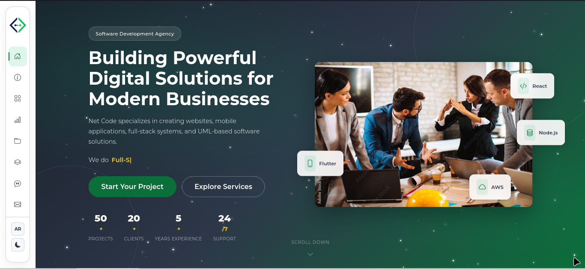

<p align="center">
  
</p>

<h1 align="center">Net Code</h1>
<p align="center">
  <strong>Software Development Agency — Tiaret, Algeria</strong>
</p>

<p align="center">
  <a href="https://netcode.dz">Visit Website</a>
</p>

---

## About

Net Code is a Tiaret-based software development agency specializing in creating websites, mobile applications, full-stack systems, and UML-based software solutions. We combine technical expertise with creative thinking to deliver products that drive real business results.

## Services

- **One-Page Business Websites** — Modern, responsive single-page websites that capture your brand essence.
- **Corporate Websites** — Multi-page platforms with CMS integration, built to scale.
- **Full-Stack Web Applications** — End-to-end applications with robust backends and modern frontends.
- **Mobile Applications** — Native and cross-platform mobile apps for iOS and Android.
- **UML Analysis & System Design** — Professional UML modeling and system architecture design.
- **Maintenance & Technical Support** — Ongoing maintenance, security updates, and 24/7 support.

## Tech Stack

| Category       | Technologies |
|----------------|-------------|
| Frontend       | React, Angular, Bootstrap 5 |
| Backend        | Node.js, Django, Laravel |
| Mobile         | Flutter, React Native |
| Database       | PostgreSQL, MongoDB, Firebase |
| DevOps         | Docker, AWS |
| Languages      | HTML5, CSS3, JavaScript (Vanilla) |

## Architecture Approaches

- **Monolithic** — Traditional all-in-one architecture for simpler projects.
- **Microservices** — Decoupled services for scalable enterprise applications.
- **Serverless** — Event-driven cloud architecture with auto-scaling.
- **Event-Driven** — Async communication for real-time reactive systems.

## Features

- Dark mode with system preference detection and persistent toggle
- Bilingual support (English / Arabic) with full RTL layout
- Smooth scroll animations via Intersection Observer
- Animated particle background and typing effects
- Responsive design across all device sizes
- EmailJS-powered contact form with validation

## Sections

1. Hero — Full-viewport intro with animated background, typing text, and statistics counters
2. About — Agency overview with experience badge and metrics
3. Services — Six service offerings with images and descriptions
4. Skills — Progress-based skill indicators
5. Portfolio — Six featured project showcases with hover overlays
6. Architecture — Approach breakdown and technology badges
7. Testimonials — Client feedback cards
8. Contact — Information cards and working contact form
9. Footer — Links, social media, and copyright

## Getting Started

Clone the repository and open `index.html` in your browser, or serve it locally:

```bash
git clone https://github.com/AbdelazizBenallou/Net-Code.git
cd Net-Code
# Serve with any static server, e.g.:
npx serve .
```

No build step required. The site is pure HTML, CSS, and JavaScript.

## Contact

- **Email:** Benallouaziz1414@gmail.com
- **Phone:** +213 558 34 06 69
- **Location:** Tiaret, Algeria
- **Facebook:** [Net Code](https://www.facebook.com/share/1DKaE7gWW7)
- **Instagram:** [@netcode_dz](https://www.instagram.com/netcode_dz)
- **LinkedIn:** [Net Code](https://linkedin.com/company/netcode)
- **GitHub:** [AbdelazizBenallou](https://github.com/AbdelazizBenallou)

---

<p align="center">
  &copy; 2026 Net Code. All rights reserved.
</p>
